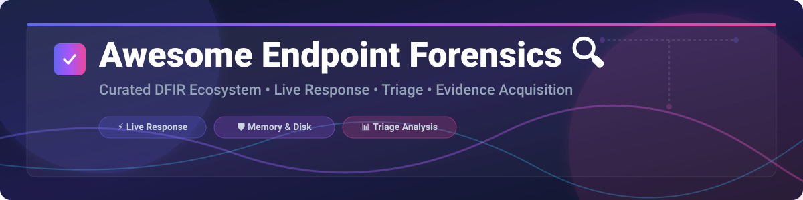

# 🔍 Awesome Endpoint Forensics & Digital Incident Response (DFIR)



<p align="center">
  <a href="https://github.com/ishandutta2007/Awesome-Awesome-Awesome"></a><a href="https://discord.gg/jc4xtF58Ve"></a>
  <a href="https://github.com/ishandutta2007/Awesome-Endpoint-Forensics/stargazers"></a>
  <a href="https://github.com/ishandutta2007/Awesome-Endpoint-Forensics/network/members"></a>
  <a href="https://github.com/ishandutta2007/Awesome-Endpoint-Forensics/blob/main/LICENSE"></a>
  <a href="https://github.com/ishandutta2007"></a>
</p>

## 🚀 Top Endpoint Forensics Platforms Ecosystem

**Curated List of SaaS Products & Open-Source GitHub Projects**

*Focused on Live Response ⚡, Endpoint Artifact Collection 📦, Digital Forensics & Incident Response (DFIR) 🛡️, Remote Triage 🕵️, and Evidence Acquisition 💾.*

**Last updated: September 2026**

---

### 💡 Overview & SEO Summary

This repository tracks top-tier **SaaS platforms** and **open-source tools** for **Endpoint Forensics**, **DFIR triage**, and **incident response**. These security solutions empower SOC analysts, incident responders, and digital forensics experts to conduct remote evidence acquisition, live memory analysis, disk parsing, and enterprise-wide threat hunting.

**Featured Solutions:** Velociraptor, Magnet AXIOM, OpenText EnCase, Exterro FTK, GRR Rapid Response, CrowdStrike Falcon Forensics, Cellebrite Endpoint Inspector, VMware Carbon Black Response, osquery, Volatility 3, YARA, and Microsoft Defender Live Response.

---

## 📑 Table of Contents

- [🏢 SaaS & Hosted Commercial Platforms](#-saashosted-commercial-platforms)
- [🔓 Open-Source GitHub Projects](#-open-source-github-projects)
- [🛠️ Workflow Integration Guidelines](#-workflow-integration-guidelines)
- [🤝 How to Contribute](#-how-to-contribute)
- [⚠️ Disclaimer](#%EF%B8%8F-disclaimer)
- [💖 Support & Sponsorship](#-support--sponsorship)
- [📈 Star History](#-star-history)

---

## 🏢 SaaS & Hosted Commercial Platforms

### 📊 Market Size & Industry Structure Analysis

> 💡 **Market Insights:** The global Digital Forensics and Incident Response (DFIR) & Endpoint Security market is estimated at **$11.8 Billion (2026)** and projected to reach **$18.5 Billion by 2030**. The sector is **moderately fragmented** with consolidations led by enterprise cybersecurity behemoths (e.g. Microsoft, CrowdStrike) acquiring niche forensic vendors, while specialized labs continue to rely on standalone enterprise suites.

### 💰 Commercial Platform Matrix

*Sorted by company size / annual revenue / market valuation (descending)*

| Product / Platform | Company Size / Valuation / Revenue | Pricing (Starting Tiers) | Free Tier Limits / Trial Terms | Key Capabilities & Overview |
| :--- | :--- | :--- | :--- | :--- |
| **[Microsoft Defender Live Response](https://learn.microsoft.com/)** | **~$3.1 Trillion** (Market Cap) | **$5.20 / user / month** (Microsoft 365 E5 / Defender for Endpoint Plan 2) | 90-day free enterprise trial with full incident response capabilities | Enterprise live interactive command-line access, remote remediation, and script execution across Windows & macOS estates. |
| **[Broadcom / VMware Carbon Black](https://www.broadcom.com/)** | **~$820 Billion** (Market Cap) | **$38.00 / endpoint / year** (Carbon Black Cloud Endpoint Standard) | 30-day enterprise evaluation trial upon request | Continuous endpoint data recording, live response shell execution, and historical activity query for incident triage. |
| **[CrowdStrike Falcon Forensics](https://www.crowdstrike.com/)** | **~$95 Billion** (Market Cap) | **$180.00 / endpoint / year** (Falcon Enterprise base package) | 15-day full-featured free trial (up to 100 endpoints) | Automated forensic artifact triage, cloud-native timeline collection, and integrated host isolation & live response shell. |
| **[OpenText EnCase](https://www.opentext.com/)** | **~$8.5 Billion** (Market Cap) | **$3,595.00 / perpetual license** (EnCase Forensic base edition) | 30-day evaluation trial with restricted export options | Gold standard computer forensics tool with deep disk parsing, court-validated evidence integrity, and timeline analysis. |
| **[Cellebrite Endpoint Inspector](https://cellebrite.com/)** | **~$3.8 Billion** (Market Cap) | **$4,500.00 / license / year** (Enterprise collector node) | 14-day guided enterprise trial for verified corporate email users | Remote enterprise endpoint collection, mobile device extraction integration, and targeted cloud artifact triage. |
| **[Magnet AXIOM](https://www.magnetforensics.com/)** | **~$1.8 Billion** (Acquisition Valuation) | **$2,800.00 / annual seat** (AXIOM Cyber edition) | 30-day full-featured trial for accredited law enforcement & enterprise security teams | Cross-platform artifact extraction (cloud, mobile, computer), visual timeline building, and memory triage. |
| **[Exterro FTK (Forensic Toolkit)](https://www.exterro.com/)** | **~$1.2 Billion** (Private Valuation) | **$3,200.00 / annual license** (FTK Pro base suite) | 30-day demo version with 5,000 index item collection limit | High-speed multi-core processing engine for massive evidence index creation, memory parsing, and disk image analysis. |
| **[Velocidex / Rapid7 Velociraptor Support](https://www.velocidex.com/)** | **~$2.5 Billion** (Rapid7 Parent Market Cap) | **$0.00** (Open-source platform); Commercial Enterprise Support starts at **$12,000.00 / year** | 100% Free Forever open-source self-hosted platform with unlimited endpoints | Enterprise VQL hunting engine, real-time artifact collection, custom forensic playbooks, and scale monitoring. |

---

## 🔓 Open-Source GitHub Projects

*Sorted by GitHub Star Count (descending)*

- **[osquery](https://github.com/osquery/osquery)** [](https://github.com/osquery/osquery/stargazers)  
  *Exposes operating system attributes as high-performance relational SQL tables across Windows, Linux, and macOS for real-time live querying and forensic triage.* 💻 SQL Triage

- **[YARA](https://github.com/VirusTotal/yara)** [](https://github.com/VirusTotal/yara/stargazers)  
  *The pattern-matching swiss-army knife for malware researchers, live memory scanning, and endpoint file artifact detection.* 🎯 Pattern Matching

- **[Cuckoo Sandbox](https://github.com/cuckoosandbox/cuckoo)** [](https://github.com/cuckoosandbox/cuckoo/stargazers)  
  *Automated dynamic malware analysis and endpoint behavior execution system.* 🧪 Automated Analysis

- **[GRR Rapid Response](https://github.com/google/grr)** [](https://github.com/google/grr/stargazers)  
  *Google's scalable enterprise remote live forensics and incident response framework—file collection, process inspection, and continuous hunting.* 📡 Remote Live Response

- **[Volatility 3](https://github.com/volatilityfoundation/volatility3)** [](https://github.com/volatilityfoundation/volatility3/stargazers)  
  *The premier open-source memory forensics framework for extracting processes, network sockets, DLLs, and kernel structures from RAM dumps.* 🧠 RAM Analysis

- **[Velociraptor](https://github.com/Velocidex/velociraptor)** [](https://github.com/Velocidex/velociraptor/stargazers)  
  *Advanced endpoint visibility, DFIR artifact hunting, and live response engine powered by Velociraptor Query Language (VQL).* ⚡ VQL Engine

- **[Timesketch](https://github.com/google/timesketch)** [](https://github.com/google/timesketch/stargazers)  
  *Collaborative forensic timeline analysis tool for indexing, searching, and visualizing events collected during incident response.* ⏱️ Timeline Analysis

- **[Autopsy](https://github.com/sleuthkit/autopsy)** [](https://github.com/sleuthkit/autopsy/stargazers)  
  *Graphical digital forensics platform and GUI interface for analyzing hard drives, media cards, and computer disk images.* 🖼️ Graphical Interface

- **[The Sleuth Kit (TSK)](https://github.com/sleuthkit/sleuthkit)** [](https://github.com/sleuthkit/sleuthkit/stargazers)  
  *Foundational C/C++ library and command-line tools for low-level volume and file system forensic investigation.* 🗄️ Disk Forensics

- **[Plaso / log2timeline](https://github.com/log2timeline/plaso)** [](https://github.com/log2timeline/plaso/stargazers)  
  *Python-based engine used to extract timestamps from security artifacts and build super-timelines for system investigations.* ⏳ Super Timeline Generator

- **[ForensicArtifacts Definitions](https://github.com/ForensicArtifacts/artifacts)** [](https://github.com/ForensicArtifacts/artifacts/stargazers)  
  *Machine-readable specification and structured repository of forensic artifact definitions used across DFIR platforms.* 📖 Artifact Knowledge Base

---

## 🛠️ Workflow Integration Guidelines

```
[Target Endpoint] ──> (Velociraptor / GRR Agent) ──> Live Triage & VQL Hunt
                                                            │
[Memory Dump]    ──> (Volatility 3 / YARA)        ──> Kernel & Malicious Code Analysis
                                                            │
[Disk Image]     ──> (Plaso / Autopsy / TSK)      ──> Super Timeline Creation
                                                            │
[Timeline Data]  ──> (Google Timesketch)          ──> Collaborative Investigation
```

---

## 🤝 How to Contribute

1. Fork the repository. 🍴
2. Create a new branch with your feature or entry (`git checkout -b feature/new-forensics-tool`).
3. Add/edit entries in `README.md` following the standard table/list formats.
4. Ensure all links are active, factual, and include proper pricing/licensing details.
5. Submit a Pull Request with a clear description of the changes! 🚀

For awesome list curation guidelines, check out the [Awesome Repository Hub](https://github.com/ishandutta2007/Awesome-Awesome-Awesome).

---

## ⚠️ Disclaimer

- This is a **community-curated list** — provided for informational, educational, and defense purposes only.
- Digital forensics requires strict adherence to legal chain of custody, proper authorization, and court validation procedures.
- Always verify licenses and commercial terms directly with vendor representatives before enterprise procurement.

---

## 💖 Support & Sponsorship

If you find this endpoint forensics repository helpful for your security operations or DFIR research, please consider supporting the project! ⭐

- 🌟 **Star this repository** to increase visibility among security professionals.
- 🔀 **Fork it** to maintain your custom forensic tool stack.
- 📢 **Share** with your blue team, SOC, and incident response colleagues.
- ☕ **Buy me a coffee / Sponsor the project:** Visit the [GitHub Sponsors Dashboard](https://github.com/sponsors/ishandutta2007) to help sustain maintenance and updates!

---

## 📈 Star History

[](https://star-history.dera.page/#ishandutta2007/Awesome-Endpoint-Forensics&type=date&legend=top-left)

---

<p align="center">
  <b>Made with ❤️ for DFIR Practitioners, Incident Responders, and Security Engineers worldwide.</b>
</p>
